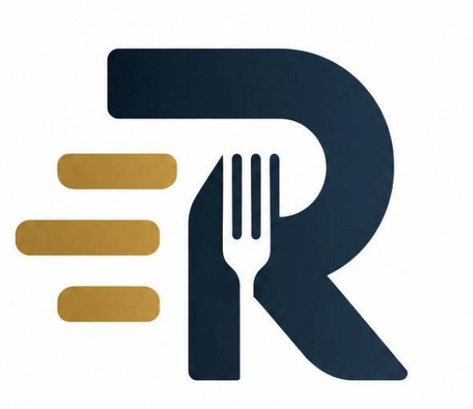

# RestoIT

Plataforma de gestión de locales gastronomicos unificada e inteligente que automatice la toma de pedidos a través de canales digitales y conversacionales 24/7, eliminando los errores humanos en el cálculo de cuentas y acelerando la atención sin requerir más personal. Al centralizar todas las comandas en tiempo real en un panel administrativo ordenado por sectores de preparación y respaldado por un módulo de análisis de datos, el comerciante logra reducir sus costos operativos, optimizar las compras de materias primas y obtener un control financiero absoluto para maximizar la rentabilidad y escalabilidad de su negocio.

  

---

### Licencia
- AGPLv3

### Integrantes
- Menager, Emanuel
- Rodríguez, Abril

### Links 
- Backend: https://github.com/arodriguezfontana/tip/tree/dev/backend
- Frontend: https://github.com/arodriguezfontana/tip/tree/dev/frontend
- Trello: https://trello.com/b/PkdE2JgS/ttip-poc
- Entregas:
- Demo:

### Elevator Pitch
Para dueños de locales gastronómicos independientes que pierden ventas y tiempo valioso gestionando pedidos de forma manual por WhatsApp y llamadas, RestoIT es una plataforma centralizada de gestión y automatización impulsada por IA que unifica los canales de venta online y conversacionales, eliminando los errores de cobro mediante cálculos deterministas en base de datos y organizando automáticamente las comandas por sectores de preparación. A diferencia de los sistemas tradicionales de delivery que cobran comisiones abusivas por cada venta o de los chatbots genéricos que no se conectan con el inventario real, nuestro proyecto combina un asistente conversacional inteligente con un panel administrativo y analítico en tiempo real, permitiendo al comerciante automatizar la atención 24/7, reducir costos operativos y escalar su rentabilidad sin necesidad de incrementar su personal.